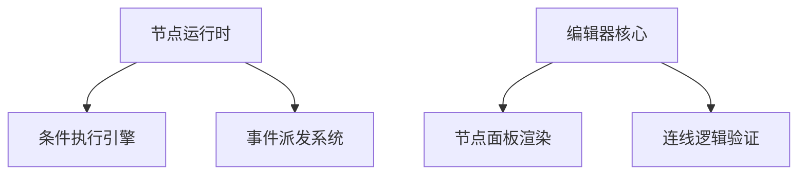
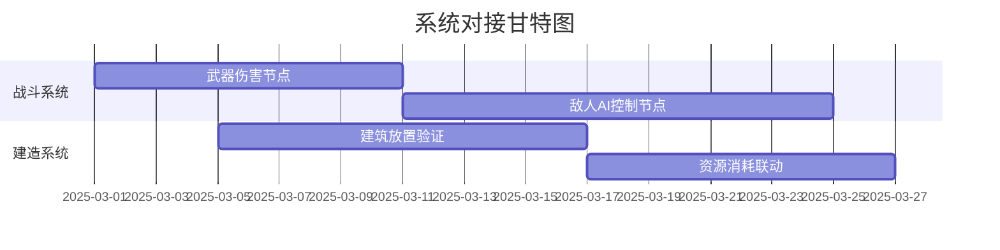
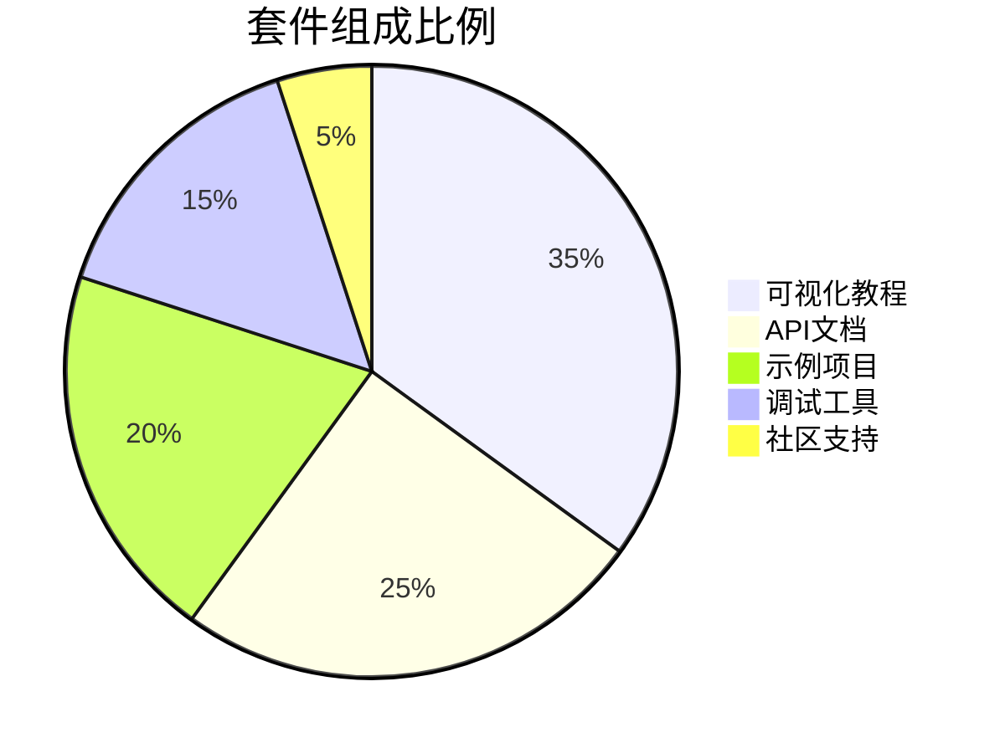

### 阶段一：基础架构验证（4-6周）

#### **开发重点**


#### **交付物**
1. **最小可运行原型（MVP）**：
   - 3种基础节点（事件触发/条件判断/动作执行）
   - 可视化连线功能
   - 简单脚本解析器

2. **技术验证报告**：
   - 节点执行性能基准测试（1000节点同时运行CPU占用<15%）
   - 跨平台兼容性测试（Windows/Mac/Android）

#### **验收标准**
1. **功能验收**：
   - ✔️ 能创建包含5个节点的简单逻辑链（事件→条件→动作）
   - ✔️ 节点执行顺序误差<50ms
   - ✔️ 崩溃率<0.1%（24小时压力测试）

2. **技术验收**：
   - 🔧 序列化存储体积<1MB/100节点
   - ⚡ 主线程占用率峰值<30%（100节点并发）

---

### 阶段二：核心系统对接（8-10周）

#### **迭代计划**


#### **关键开发项**
1. **系统适配层开发**：
   ```csharp
   // 示例：电力系统适配器
   public class PowerSystemBridge : MonoBehaviour {
       [SystemInterface("电力网络")]
       public static bool CheckCircuitStatus(int circuitId) {
           return PowerCore.GetCircuit(circuitId).IsActive;
       }
       
       [SystemEvent("电力过载")]
       public static void OnPowerOverload(Action<string> callback) {
           PowerCore.OverloadEvent += callback;
       }
   }
   ```

2. **复合节点生成器**：
   - 自动生成常见组合逻辑（if-else链、定时循环等）
   - 提供参数化模板（如"波次生成器"需配置敌人类型/数量/间隔）

#### **验收标准**
1. **系统覆盖率**：
   - ✅ 已完成系统100%对接（战斗/建造/电力）
   - 🔄 未完成系统预留接口（种植/载具需完成30%）

2. **稳定性指标**：
   - 🛡️ 内存泄漏<5MB/小时连续运行
   - 🔥 异常捕获率>95%

---

### 阶段三：生产级工具链建设（6-8周）

#### **工具矩阵**
| 工具类型       | 功能要点                     | 技术指标                  |
|----------------|------------------------------|---------------------------|
| **调试器**     | 断点调试/变量监视            | 单步执行延迟<200ms        |
| **性能分析仪** | 节点执行耗时热力图           | 采样精度±5ms              |
| **版本控制器** | 节点蓝图差异对比             | 支持100+版本历史          |

#### **核心功能验证**
1. **调试流程测试**：
   ```bash
   # 测试用例 - 条件断点
   1. 在"玩家血量<30%"节点设置断点
   2. 触发战斗事件使血量降至25%
   3. 验证调试器是否暂停并显示正确堆栈
   ```

2. **性能优化验收**：
   - 通过节点合并优化使执行效率提升40%+
   - 内存占用降低30%（通过对象池实现）

---

### 阶段四：UGC生态建设（持续迭代）

#### **开发者套件组成**


#### **验收里程碑**
1. **初次用户测试**：
   - 10组用户完成指定任务：
     - 创建自动防御系统（需使用战斗+建造节点）
     - 制作昼夜照明控制（需电力+光照节点）
   - 任务完成率>80%

2. **生产就绪标准**：
   - 📚 文档覆盖率100%（含异常代码说明）
   - 🧪 单元测试覆盖率≥75%
   - 🐛 关键路径BUG率<0.5个/千行代码

---

### 阶段五：运维监控体系（配套建设）

#### **监控维度**
| 监控类型       | 指标示例                     | 告警阈值              |
|----------------|------------------------------|-----------------------|
| **逻辑安全**   | 死循环检测                   | 单节点执行>5秒        |
| **资源占用**   | 内存泄漏趋势                 | 每小时增长>10MB       |
| **使用分析**   | 高频使用节点TOP10            | 统计每日使用次数      |

#### **验收要求**
1. **建立自动化报警机制**：
   - 关键异常15分钟内推送
   - 性能劣化趋势预警准确率>90%

2. **日志系统能力**：
   - 支持10万级节点运行日志/秒
   - 关键操作溯源时间<30秒

---

### 风险管理策略
1. **技术风险应对**：
   - 设立架构评审委员会（每周审查设计决策）
   - 保留20%工时用于技术债务清理

2. **进度控制**：
   - 采用燃尽图监控开发进度
   - 每迭代周期（2周）进行进度校准

3. **质量保障**：
   - 实施自动化回归测试（每日构建）
   - 关键模块采用A/B方案并行开发

---

通过这种阶梯式推进策略，既能确保每个阶段产出可验证的成果，又能通过持续集成及早发现系统缺陷。建议配合Jira等项目管理工具进行任务拆解，并建立跨职能的验收小组（程序+策划+QA）共同参与各阶段评审。